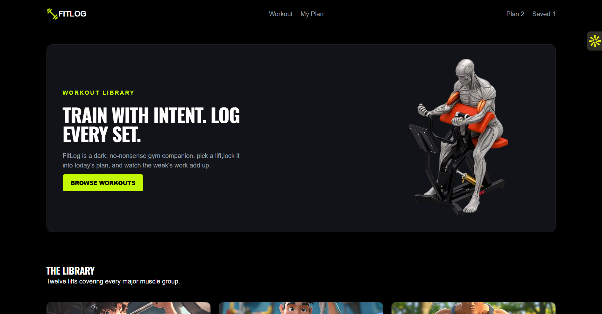
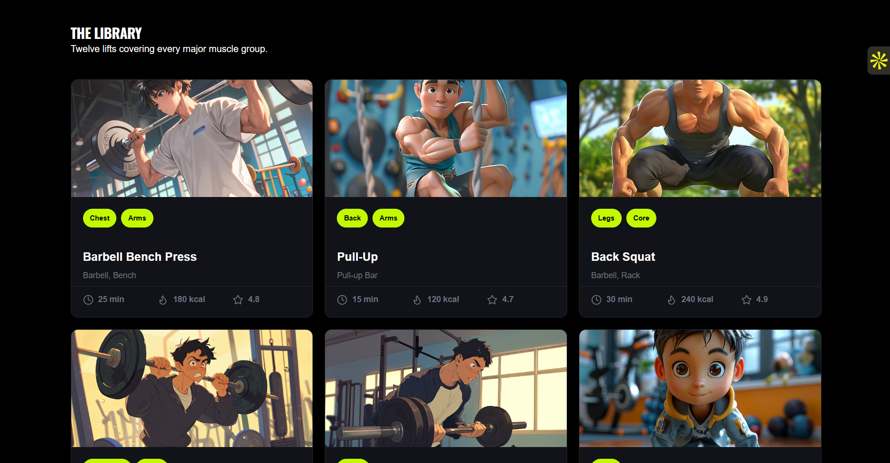
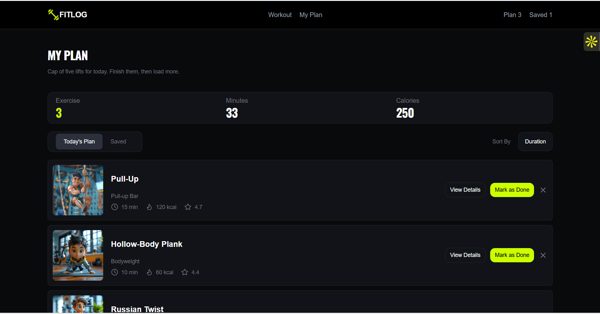

# FitLog — Workout Library

FitLog is a dark, responsive workout library designed to help users explore workouts, view detailed workout information, create a personal workout plan, save workouts for later, and track completed workouts.

## Live Demo

https://fitlog-workout-blush.vercel.app/

## Screenshots

### Workout Library



### Workout Details



### My Plan



## Technologies Used

* **Next.js** — React framework for building the application
* **React** — Component-based UI development
* **TypeScript** — Type-safe JavaScript
* **Tailwind CSS** — Responsive and utility-first styling
* **Lucide React** — Icons
* **REST API** — Fetching workout data
* **LocalStorage** — Storing personal plan, saved workouts, and completed workouts
* **Vercel** — Deployment

## Key Features

### 1. Workout Library

Browse a collection of workouts with useful information including:

* Workout name
* Muscle groups
* Equipment
* Duration
* Calories burned
* Rating

### 2. Workout Details

View detailed information about each workout, including:

* Description
* Difficulty
* Muscle groups
* Equipment
* Duration
* Calories
* Sets and reps
* Step-by-step instructions

## Project Structure

```text
FitLog/
├── app/
│   ├── my-plan/
│   ├── workout/
│   ├── layout.tsx
│   ├── page.tsx
│   └── globals.css
│
├── components/
│   ├── Navbar.tsx
│   ├── Footer.tsx
│   ├── WorkoutLibrary.tsx
│   ├── WorkOutCards.tsx
│   └── WorkoutAction.tsx
│
├── public/
│   ├── assets/
│   └── screenshots/
│
├── package.json
└── README.md
```

## Deployment

FitLog is deployed using **Vercel**.

## Author

**Tasmia Akter**

GitHub: [@tasmia-maha](https://github.com/tasmia-maha)

